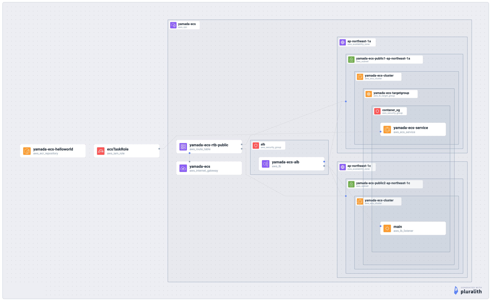

## このリポジトリは？

以下を目的とするためのもの。

- ECSでコンテナーを動かすことを体感する

## やってること

- AWSの環境はterraformで作る
- GitHubActionsでCI/CD
  - ECRにPUSH
  - ECSタスクを更新（ローリングアップデート）

## AWSで構築する環境

Pulurarithで出力した構成図。



## 参考

タスク定義jsonの出力。

```
aws ecs describe-task-definition --task-definition yamada-ecs-task-definition | \
  jq '.taskDefinition | del (.taskDefinitionArn, .revision, .status, .requiresAttributes, .compatibilities)' > task-def.json
```