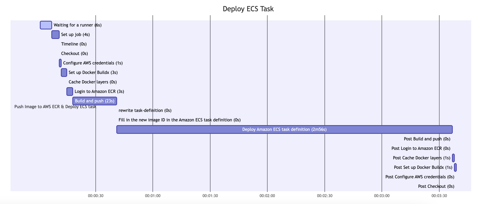

## このリポジトリは？

以下を目的とするためのもの。

- ECSでコンテナーを動かすことを体感する
- ECSの検証を手軽にする

## できること

- AWSの環境はterraformで作る
- GitHubActionsでCI/CD
  - コードをGitHubにPUSH
  - golangコンパイル、イメージビルド
  - ECRにPUSH
  - ECSタスクを更新（ローリングアップデート）
- ~~EFSをマウントするので、ファイルを永続化できるようにしている（EFSのIDは手で変更すること）~~　EFSIDをタスク定義にうまいこと渡せないのでやめた
- ECS EXECに対応しているので、タスクにアタッチできる
- GitHub Actionsの実行時間をTimelineで参照できる



## 使い方

### terraformで環境構築

```bash
terraform apply
```

構築が完了すると、以下のように、URLが表示される。このURLをHTTPでアクセスする。

```
ALB_DNS_NAME = "yamada-ecs-alb-1063581498.ap-northeast-1.elb.amazonaws.com"
```

### 注意事項

GitHubActionsでのデプロイに時間がかかることに注意。

約3分ちょっとぐらいかかる。

## 参考

デバッグなどで使用したコマンドは以下。

### タスク定義の登録

タスク定義の登録方法。タスクを定義したjsonファイルを使用する。

```bash
aws ecs register-task-definition --cli-input-json file://task-def.json
```
### ECSデプロイ

GitHubActionsでデプロイまでするのだけど、デプロイの試行錯誤を繰り返すにはコマンドが便利。コマンドは以下を使う。

```bash
aws ecs update-service --cluster yamada-ecs-cluster --service yamada-ecs-service --task-definition yamada-ecs-task-definition
```

### タスク定義の出力

ゼロからタスク定義のjsonを作るのは面倒。以下のコマンドでタスク定義のベースとなるファイルを作成することができる。ベースとなるファイルを作成してから、不要なものを削除すると早い。

```bash
aws ecs describe-task-definition --task-definition yamada-ecs-task-definition | \
  jq '.taskDefinition | del (.taskDefinitionArn, .revision, .status, .requiresAttributes, .compatibilities)' > task-def.json
```

### ECSのコンテナにアタッチする

タスク上で動作するコンテナにアタッチするときに使用する。

```bash
aws ecs execute-command \
--cluster yamada-ecs-cluster \
--task 255d419838dc4b959b70f8e4fc154c1c \
--container golang-helloworld \
--interactive \
--command /bin/sh
```


### ECS EXECに対応しているか確認

ECSのサービスがECS EXECに対応しているかを確認するためのコマンド。コンテナにアタッチできない場合の確認に使用する。

```bash
aws ecs describe-services \
--cluster yamada-ecs-cluster \
--services yamada-ecs-service \
--query 'services[0].enableExecuteCommand'
```

タスクの確認

```bash
aws ecs describe-tasks \
--cluster yamada-ecs-cluster \
--tasks cdc027ce890d40b3a51370fb5fbbc0ef \
--query 'tasks[0].enableExecuteCommand'
```
### タスクのリスト

タスクは10文字以上のIDで表示される。タスクのリストを出力したい場合に以下を使用する。

```bash
aws ecs list-tasks \
--cluster yamada-ecs-cluster \
--service yamada-ecs-service
```

